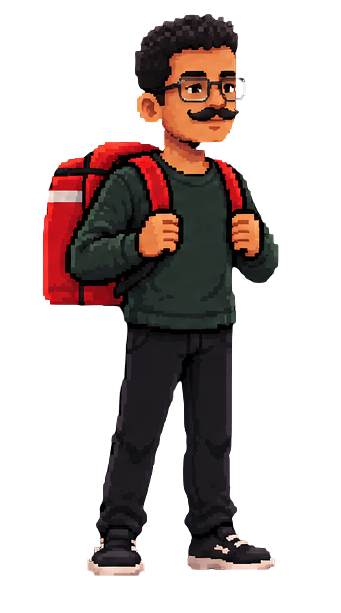
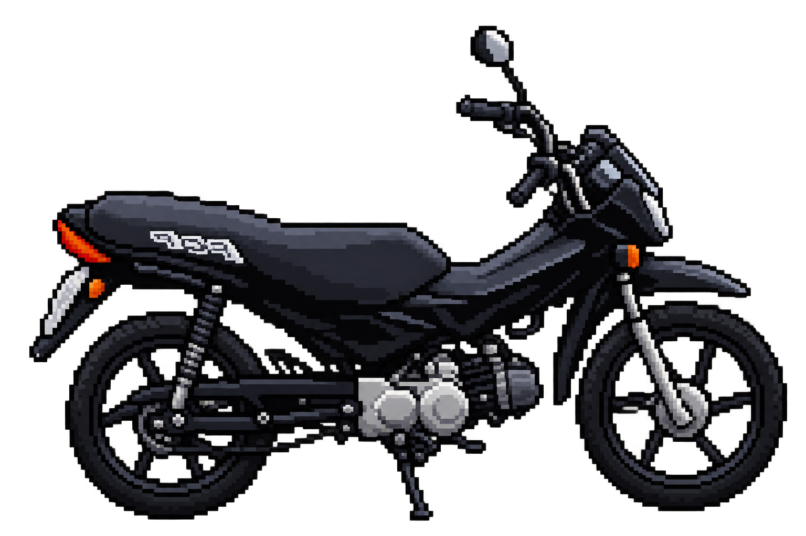

# Guia: personagem andando até a pop (tela3 → tela4)

Objetivo: ao clicar em **"Suba na pop e vá trabalhar"**, a imagem `parado.png`
anda (trocando entre `andando1.png`/`andando2.png` para simular os passos) até
chegar na posição onde está `pop.png`. Quando chegar lá, a página troca para
`tela4.html` (que já existe no projeto).

---

## Passo 1 — HTML: dar `id` às imagens que o JS vai controlar

No `tela3.html`, dê um `id` na imagem do personagem parado e outro na imagem
da pop, porque o JavaScript precisa achar as duas: uma para mover, outra para
saber até onde mover.

```html



```

A classe (`parado`, `pop`) continua igual — é só para o CSS. O `id` é o que o
JavaScript vai usar.

---

## Passo 2 — Entender a ideia da animação

Não existe um comando pronto "andar até". A gente simula isso em pequenos
passos, usando `setInterval` (que repete uma função de tempos em tempos, tipo
um "loop com pausa"):

1. A cada "tick" (por exemplo, a cada 150ms):
   - move o personagem um pouquinho para a direita (`style.left`, em pixels);
   - troca a imagem entre `andando1.png` e `andando2.png`, para parecer que
     ele está caminhando.
2. Depois de mover, verifica: "o personagem já chegou (ou passou) da posição
   da pop?"
   - Se **não** chegou → o `setInterval` continua rodando e repete o passo 1.
   - Se **chegou** → para o `setInterval` (`clearInterval`) e troca de página
     com `window.location.href = "tela4.html"`.

---

## Passo 3 — JavaScript: código completo

No `script.js` (o arquivo já existe e é usado nas 3 telas — repare que o botão
`btnAcordar` já é protegido com um `if`, então vamos seguir o mesmo padrão),
adicione ao final do arquivo:

```javascript
// ----- Tela 3: personagem anda até a pop e troca para a tela4 -----
const imgPersonagem = document.getElementById("imgPersonagem");
const imgPop = document.getElementById("imgPop");
const btnSubanamoto = document.getElementById("btnSubanamoto");

// só roda essa lógica se os elementos existirem nessa página (tela3)
if (btnSubanamoto) {
    btnSubanamoto.addEventListener("click", function () {
        btnSubanamoto.disabled = true; // evita clicar de novo enquanto anda

        // posição atual do personagem e posição alvo (onde a pop está), em pixels
        let posAtual = parseFloat(getComputedStyle(imgPersonagem).left);
        const posAlvo = parseFloat(getComputedStyle(imgPop).left);

        const passo = 10;   // quantos pixels ele anda a cada "tick"
        let frame = 1;      // controla qual perna/imagem mostrar

        const andando = setInterval(function () {
            posAtual += passo;
            imgPersonagem.style.left = posAtual + "px"; // move o personagem

            // alterna entre andando1.png e andando2.png (efeito de passos)
            imgPersonagem.src = frame === 1 ? "assets/andando1.png" : "assets/andando2.png";
            frame = frame === 1 ? 2 : 1;

            // chegou (ou passou) da posição da pop?
            if (posAtual >= posAlvo) {
                clearInterval(andando); // para o loop
                window.location.href = "tela4.html"; // troca de tela
            }
        }, 150); // repete a cada 150 milissegundos
    });
}
```

### Explicação linha por linha

- `getElementById("imgPersonagem")` / `getElementById("imgPop")` /
  `getElementById("btnSubanamoto")` → pegam os elementos pelos `id`s do
  Passo 1.
- `if (btnSubanamoto) { ... }` → como o `script.js` é compartilhado entre as
  telas, esse `if` garante que esse código só roda na `tela3.html` (nas outras
  telas, `btnSubanamoto` seria `null`, e chamar `.addEventListener` num `null`
  daria erro).
- `getComputedStyle(elemento).left` → lê o valor atual da propriedade CSS
  `left` do elemento (o que está definido em `tela3.css`) e devolve algo como
  `"450px"`.
- `parseFloat(...)` → converte esse texto (`"450px"`) num número (`450`), para
  dar pra fazer conta.
- `setInterval(funcao, 150)` → chama `funcao` repetidamente, de 150 em 150
  milissegundos, até alguém mandar parar com `clearInterval`.
- `posAtual += passo` → soma `10` pixels na posição a cada repetição.
- `imgPersonagem.style.left = posAtual + "px"` → aplica a nova posição
  diretamente no elemento (isso sobrescreve o `left` do CSS, o que é esperado
  aqui).
- `frame === 1 ? "assets/andando1.png" : "assets/andando2.png"` → é um
  jeito curto de escrever um "if/else": se `frame` for `1`, usa
  `andando1.png`, senão usa `andando2.png`.
- `frame = frame === 1 ? 2 : 1` → alterna o valor de `frame` entre `1` e `2`
  a cada repetição, pra próxima vez trocar de perna.
- `if (posAtual >= posAlvo)` → compara a posição atual com a posição da pop.
  Quando o personagem alcança (ou ultrapassa) esse valor, entra aqui.
- `clearInterval(andando)` → para de repetir a função (senão ele ficaria
  andando pra sempre).
- `window.location.href = "tela4.html"` → troca a página para `tela4.html`.

---

## Passo 4 — Testar e ajustar a velocidade/distância

1. Abra `tela3.html` no navegador e clique no botão.
2. Veja se o personagem se move em direção à pop, alternando as duas imagens
   de andar.
3. Ajuste conforme o efeito que quiser:
   - `passo` maior (ex.: `20`) → anda mais rápido (menos passos até chegar).
   - o número em `setInterval(..., 150)` menor (ex.: `100`) → troca de quadro
     mais rápido (passos mais "nervosos").
   - Se ele passar direto pela pop sem "encostar" visualmente, ajuste
     `posAlvo` subtraindo um valor fixo, por exemplo:
     ```javascript
     const posAlvo = parseFloat(getComputedStyle(imgPop).left) - 40;
     ```
     isso faz ele parar 40px antes da posição exata da pop.

---

## Observação sobre a tela4

O `tela4.html` já existe no projeto — não precisa criar nada novo para o
destino, só garantir que o `<script src="script.js">` também esteja linkado
nela (do mesmo jeito que nas outras telas) e que ela tenha o CSS/conteúdo que
você já preparou.
