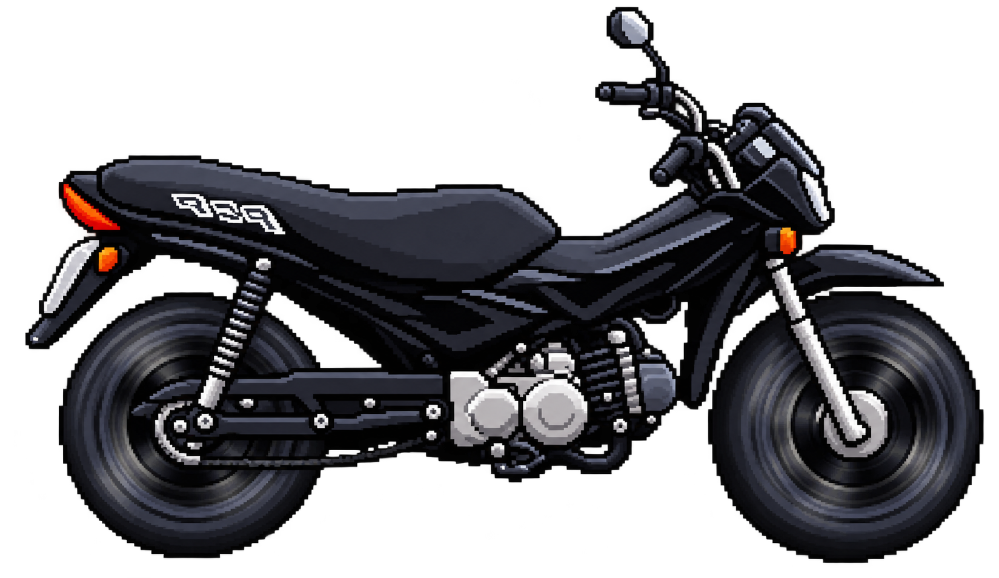
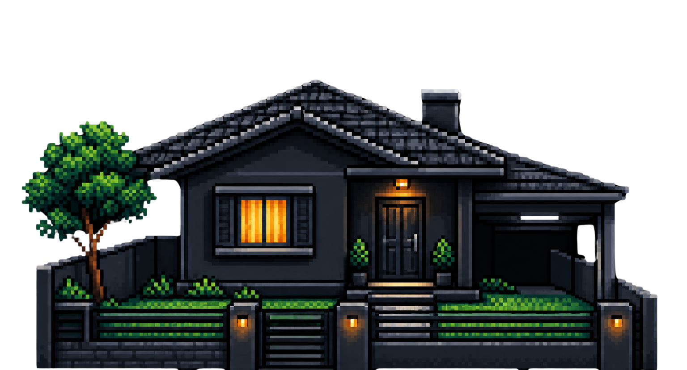

# Guia: nuvem andando + encerrar expediente (tela4)

A tela4 tem 3 coisas para implementar:

1. A nuvem entra pela direita e sai pela esquerda **o tempo todo**, em loop,
   para simular que a moto está se movendo (isso é só CSS, roda sozinho, sem
   precisar de clique).
2. Ao clicar em **"Encerrar expediente"**: o fundo do `body` vira a cor sólida
   `#AEB8C5`. A imagem continua em `correndo.png` — ainda não troca aqui.
3. Uma imagem da casa "chega" na tela (desliza até uma posição de parada). Assim
   que ela termina de chegar, a imagem `correndo.png` é trocada direto por
   `pop.png` (moto estacionada do lado da casa).

---

## Parte 1 — Nuvem em loop (CSS puro, com `@keyframes`)

Hoje o `.nuvem` no `tela4.css` tem posição fixa (`top: 200px; left: 200px;`).
Para ela ficar andando sozinha, sem depender de JavaScript, use uma animação
CSS com `@keyframes`:

```css
@keyframes andarNuvem {
    from {
        left: 100%;   /* começa fora da tela, à direita */
    }
    to {
        left: -200px; /* termina fora da tela, à esquerda */
    }
}

.nuvem {
    position: absolute;
    top: 200px;

    width: 150px;
    height: 50px;

    background-color: #f1f3f5;
    border-radius: 50px;

    animation: andarNuvem 4s linear infinite;
}
```

O que mudou: tirei o `left: 200px;` fixo (porque agora quem controla o `left`
é a animação) e adicionei `animation: andarNuvem 4s linear infinite;`.

### Explicação

- `@keyframes andarNuvem { from {...} to {...} }` → define uma animação
  chamada `andarNuvem`, que começa (`from`) com `left: 100%` (fora da tela, à
  direita) e termina (`to`) com `left: -200px` (fora da tela, à esquerda).
- `animation: andarNuvem 4s linear infinite;` → aplica essa animação no
  elemento `.nuvem`:
  - `4s` → demora 4 segundos para ir de um lado a outro (ajuste para deixar
    mais rápido ou mais lento);
  - `linear` → a velocidade é constante (sem acelerar/desacelerar);
  - `infinite` → repete para sempre, criando o efeito de loop.

Isso já resolve o item 1 sozinho, sem precisar tocar no `script.js`.　
(As `.nuvem-bolha` de dentro da nuvem não precisam mudar — elas são
posicionadas *relativas* à `.nuvem`, então andam junto automaticamente.)

---

## Parte 2 — Botão "Encerrar expediente": só o fundo sólido

### HTML

Dê um `id` na imagem `correndo.png` mesmo assim — ela vai ser trocada mais
adiante, na Parte 3, quando a casa chegar:

```html

```

### JavaScript

No `script.js`, siga o mesmo padrão usado nas outras telas (`if (btnX) {...}`,
já que o arquivo é compartilhado entre todas as telas):

```javascript
// ----- Tela 4: encerrar expediente -----
const imgCorrendo = document.getElementById("imgCorrendo");
const btnEncerrar = document.getElementById("btnEncerrar");

if (btnEncerrar) {
    btnEncerrar.addEventListener("click", function () {
        btnEncerrar.disabled = true; // evita clicar de novo

        // o dia passou: fundo vira uma cor sólida
        document.body.style.background = "#AEB8C5";
    });
}
```

### Explicação

- `document.body.style.background = "#AEB8C5"` → troca o `background`
  (hoje um `linear-gradient(...)` no `tela4.css`) por uma cor sólida, aplicada
  direto no elemento via JavaScript (isso tem prioridade sobre o CSS do
  arquivo).
- Repare que **não** trocamos `imgCorrendo.src` aqui — a imagem continua
  `correndo.png` até a casa terminar de chegar (Parte 3).

---

## Parte 3 — A casa "chega" e a moto estaciona (pop.png)

Aqui a ideia é: a imagem da casa começa fora da tela (à direita) e, quando o
expediente é encerrado, ela desliza até uma posição de "chegada". Quando essa
animação termina, trocamos `correndo.png` direto por `pop.png`.

### HTML

Adicione a imagem da casa em `tela4.html` (ela ainda não existe nessa tela):

```html

```

### CSS

No `tela4.css`, crie a classe `.casaChegando` já posicionada fora da tela, com
uma `transition` no `left`:

```css
.casaChegando {
    width: 500px;
    height: 269px; /* mantém proporção parecida com casa.png */
    bottom: 0px;
    position: absolute;

    left: 100%;              /* começa fora da tela, à direita */
    transition: left 3s linear; /* quando o left mudar, anima em 3s */
}

.casaChegando.chegou {
    left: 55%; /* posição final — ajuste até ficar do lado da moto */
}
```

### Explicação

- `left: 100%` → a casa começa totalmente fora da tela, à direita (fora da
  área visível de `.tela-4`).
- `transition: left 3s linear;` → diz ao navegador: "sempre que o `left`
  desse elemento mudar, não troque de uma vez, anime a mudança em 3 segundos".
- `.casaChegando.chegou { left: 55%; }` → é a posição final. Quando o
  JavaScript adicionar a classe `chegou` no elemento, o `left` muda de `100%`
  para `55%`, e por causa da `transition`, isso desliza suavemente (não pula
  direto).

### JavaScript: disparar a chegada e detectar quando ela termina

Complete o bloco do `btnEncerrar` e adicione um novo listener para saber
quando a casa "terminou de chegar":

```javascript
const imgCasaChegando = document.getElementById("imgCasaChegando");

if (btnEncerrar) {
    btnEncerrar.addEventListener("click", function () {
        btnEncerrar.disabled = true;

        document.body.style.background = "#AEB8C5";

        imgCasaChegando.classList.add("chegou"); // dispara a transition do CSS
    });
}

// dispara quando a transition do CSS da casa termina (ela "chegou")
if (imgCasaChegando) {
    imgCasaChegando.addEventListener("transitionend", function () {
        imgCorrendo.src = "assets/pop.png"; // moto estacionada
    });
}
```

### Explicação

- `imgCasaChegando.classList.add("chegou")` → adiciona a classe `chegou` no
  elemento. Como o CSS já tem `transition: left 3s linear`, o navegador anima
  sozinho a mudança de `left: 100%` para `left: 55%`.
- `"transitionend"` → é um evento que o navegador dispara automaticamente
  quando uma `transition` do CSS termina. Aqui, usamos ele para saber
  exatamente o momento em que a casa "chegou" na posição final.
- Dentro desse evento, trocamos `imgCorrendo.src` direto de `"correndo.png"`
  para `"assets/pop.png"` — nesse momento a moto estava correndo e, assim que
  a casa termina de chegar, ela já aparece estacionada.

---

## Passo a passo para testar

1. Abra `tela4.html` — a nuvem deve ficar entrando pela direita e saindo pela
   esquerda em loop, sem precisar clicar em nada.
2. Clique em "Encerrar expediente":
   - o fundo muda para a cor sólida `#AEB8C5`;
   - a moto continua em `correndo.png`;
   - a casa começa a deslizar da direita para a posição definida em
     `.casaChegando.chegou`.
3. Quando a casa terminar de deslizar (depois dos 3 segundos da `transition`),
   a imagem da moto muda direto de `correndo.png` para `pop.png`.

### Ajustes finos

- Duração/velocidade da nuvem: mude o `4s` em `animation: andarNuvem 4s ...`.
- Duração da chegada da casa: mude o `3s` em `transition: left 3s linear;`
  (troque nos dois lugares — na `.casaChegando` — para manter consistente).
- Posição final da casa (onde ela "estaciona" ao lado da moto): ajuste o
  `left: 55%` em `.casaChegando.chegou` olhando no navegador até ficar do lado
  certo da moto/personagem.
